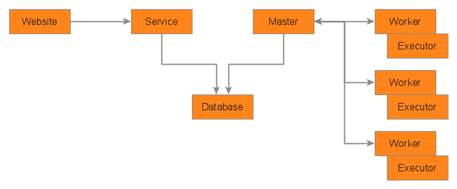

# Architecture

The project is divided between several applications:
* The database, which stores information about jobs, runs, workers, etc.
* The master, which supervises workers, distributes runs and saves results to the database.
* The service, which exposes a web api to retrieve information from the database and to interact with the master.
* The website, a web interface on top of the service for it to be usable by end users.
* The workers, which executes runs assigned to them by the master and send back results.

The project is structured with a python package for each component as each one has its own process and can run separately from the others. The model package includes common code.

## Database

The database stores information used by the various applications. It is accessed directly only by the master and the service.

Currently, the project supports MongoDB and SQL databases.

See [Data Model](data_model.md) for more information on the data itself.

## Master

The master is the application responsible for scheduling the runs and monitoring them. It is composed notably of a job scheduler and a worker supervisor.

The job scheduler periodically checks the database for pending runs and searches an available and adequate worker to execute each one. It also triggers runs for timed schedules.

The worker supervisor hosts a websocket server which listens for worker connections. On connection, the worker is authenticated and registered, then placed in a pool of active workers, ready to be assigned runs.

Runs get assigned to a worker by a worker selector, which defines rules based on job and worker properties. This logic can be extended to match business requirements, for example checking for an operating system, available software, available resources, project authorizations, etc.

## Service

The service exposes a web API, for the website and any other applications. It serves as an interface with the database and through it with the master.

The service is composed of various controllers, for administration and for each resource type, of which functions are mapped to web routes.

The service expects json payloads and returns json responses.

Access to the web routes is limited by authorizations. A user has to login with the service and then send an authentication token with each request, using basic authentication. Anonymous requests are authorized on a few public routes, notably help and login.

## Website

The website hosts web pages for end users. It is the actual application with which the users will interact.

It follows a structure similar to the service, with controllers and web routes.

Its implementation relies heavily on the service, as its source of information and the interface on which it acts.

## Worker

The worker is the application responsible for executing the job runs.

The worker connects to the master, authenticates and registers itself, then waits for commands from the master. When a run request arrive, the worker spawns an executor process to handle it. As the run progresses, the executor writes status, results and log files to the file system. The worker sends these back to the master as update messages.

The communication uses a bidirectional websocket connection, and may be interrupted and recovered without affecting the active executors.

Depending on the nature of the jobs the worker executes, a worker may support one or many executors. For example, some workers can run jobs with intensive resource or which do not support concurrent executions, while others can be dedicated to lightweight jobs which delegates to another system or watches over some remote process.

The executor implements a basic flow for a job execution. Depending on the use case, it can be appropriate to have a custom executor or to delegate the logic to the job itself, through its definition and possible commands which are executed.
