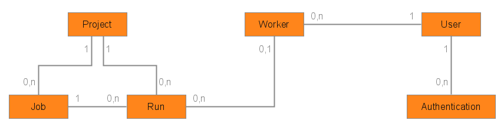

# Data Model

## Project

Represents a project associated with Orchestra, it is a space for jobs, schedules and runs.

* identifier: the unique string key used to identify the project
* display_name: the user-friendly name displayed in user interfaces
* services: the dictionary of services associated with the project
* creation_date: the UTC date at which the project was created
* update_date: the UTC date at which the project was updated last

## Job

Represents a job to be executed by a worker, with requirements, parameters and the commands to run.

* project: the identifier of the project to which the job belongs
* identifier: the string key unique within the project, used to identify the job
* display_name: the user-friendly name displayed in user interfaces
* description: the description of what the job does, to be diplayed in user interfaces
* workspace: the directory where the job is executed on a worker
* steps: the list of commands to execute
	* step.name: the step name
	* step.command: the command as an array of strings, to be formatted and passed to python subprocess
* parameters: the list of parameters available for the job
	* parameter.key: the unique string key to identify the parameter
	* parameter.description: the description of the parameter, to be displayed in user interfaces
* properties: the dictionary of properties associated with the job, to help match it with a worker
* is_enabled: the boolean indicating if the job is enabled or not, runs for a disabled job do not get scheduled
* creation_date: the UTC date at which the job was created
* update_date: the UTC date at which the job was updated last

## Run

Represents a job execution, with its status.

* project: the identifier of the project to which the run belongs
* identifier: the unique string key used to identify the run, implemented as a UUID
* job: the identifier of the job for which the run was triggered
* parameters: the dictionary of parameters passed with the trigger, as key value pairs
* source: the dictionary describing the trigger source
* worker: the identifier of the worker to which the run was assigned
* status: the current status of the run
* steps: the list of commands to execute
	* step.name: the step name
	* step.index: the step index in the list
	* step.status: the current status of the command
* start_date: the UTC date at which the run was started on the worker
* completion_date: the UTC date at which the run was completed on the worker
* should_cancel: the boolean indicating if a cancel was requested
* should_abort: the boolean indicating if an abort was requested
* creation_date: the UTC date at which the run was created
* update_date: the UTC date at which the run was updated last

## Schedule

Represents a timed job schedule, so that it gets triggered at specific times.

* project: the identifier of the project to which the schedule belongs
* identifier: the string key unique within the project, used to identify the schedule
* display_name: the user-friendly name displayed in user interfaces
* job: the identifier of the job to trigger
* parameters: the dictionary of parameters to pass with the trigger, as key value pairs
* expression: the cron expression defining when the job gets triggered
* is_enabled: the boolean indicating if the schedule is enabled or not, disabled schedules will not trigger runs
* last_run: the identifier of the last triggered run
* creation_date: the UTC date at which the schedule was created
* update_date: the UTC date at which the schedule was updated last

## User

Represents a user accessing the service, with its authorizations.

* identifier: the unique string key used to identify the user
* display_name: the full name displayed in user interfaces
* roles: the list of roles attributed to the user, which define their authorizations
* is_enabled: the boolean indicating the user is enabled or not, a disabled user has the same authorizations as an anonymous user
* creation_date: the UTC date at which the user was created
* update_date: the UTC date at which the user was updated last

## User Authentication

Represents a mean for a user to authenticate with the service.

* identifier: the unique string key used to identify the authentication, implemented as a UUID
* user: the identifier of the user for which the authentication is
* type: the type of the authentication (by password or by token)
* hash_function: the string identifying the hash function used to protect the secret
* hash_function_parameters: the dictionary of parameters to pass to the hash function invocation
* hash_function_salt: the random salt used with the hash function, as a hexadecimal string
* secret: the password or token, in its protected form, after salt and hash
* expiration_date: the UTC date at which the authentication expires, an expired token is an invalid authentication
* creation_date: the UTC date at which the authentication was created
* update_date: the UTC date at which the authentication was updated last

## Worker

Represents a worker known by the master, to which runs will be assigned for execution.

* identifier: the unique string key used to identify the worker
* owner: the identifier of the user to which the worker belongs
* version: the version of the worker application currently running
* display_name: the user-friendly name displayed in user interfaces
* properties: the dictionary of properties associated with the worker, to help match jobs with it
* is_enabled: the boolean indicating if the worker is enabled of not, runs will not be assigned to disabled workers
* is_active: the boolean indicating if the worker is known to be active by being currently connected to the master
* should_disconnect: the boolean indicating if a disconnect was requested
* creation_date: the UTC date at which the worker was created
* update_date: the UTC date at which the worker was updated last
