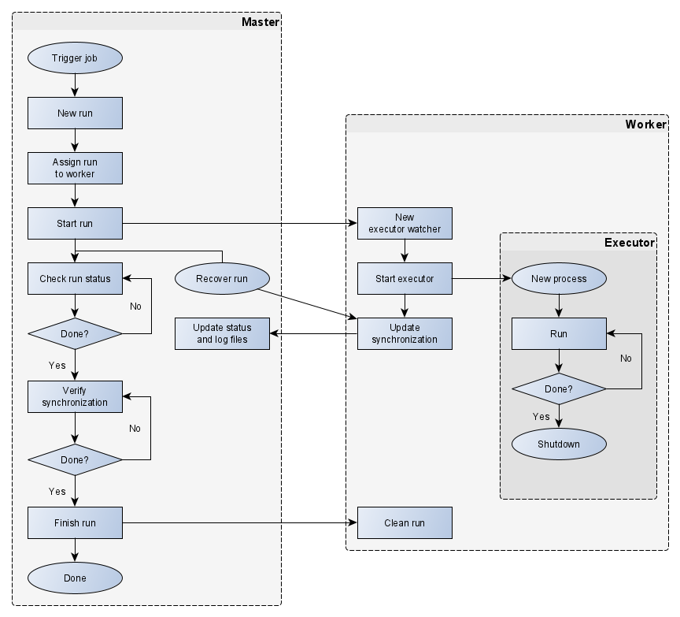
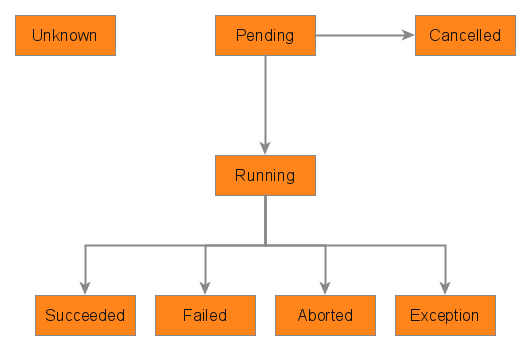

# Run

A run object represents a single execution of a job.

A run is created when a job is triggered by a request to the service or from a schedule. The job scheduler checks regularly for pending runs and will try to schedule the run, by invoking the worker selector to look for an available worker which is suitable for the job and run. The job scheduler defines an expiration time, after which a run will be cancelled if it still has not be assigned to a worker.

The worker proxy, meaning the worker object in the master process, implements a state machine to manage executors.

The worker proxy starts the run by sending an `execute` command with the run details (the identifier, the job definition and the parameters) to the remote worker. The worker process saves the run request to its local storage and spawns an executor process which will be responsible for the run itself.

While the run is in progress, the executor saves the run status to the worker local storage, as well as log files and results that the commands may have generated. The worker process monitors its storage for changes and forwards them as updates to the master, to synchronize their information.

Once the run completes, the worker proxy waits for the synchronization to complete. Finally, the worker proxy sends a `clean` command so that the remote worker removes its local storage of the run information.

If a run is cancelled (from a request or by expiring), it will not be executed. A run can only be cancelled while it status is pending and it has not been assigned to a worker.

If a run is aborted (from a request or from a signal to the worker process), it will attempt to terminate gracefully, and will complete as normally (with an aborted status). In the case of the process being signaled, the worker connection is closed immediately, meaning the worker will need to restart and recover the run for its information to be synchronized to the master.

If the worker process terminates with local runs still present, or if the connection with the master is closed, the runs will be recovered on reconnection. When the worker process starts, it recovers its runs its local storage. When the connection is established, the worker proxy sends `list` and `request` commands to recover the state of the runs on the remote worker. Then the flow resumes as normal from a running state.

## Run flow

1. A job is triggered by a request to the service or from a schedule
2. A run record is created in the database
3. The job scheduler retrieves the run as part of all pending runs
4. The worker selector looks for an available and suitable worker
5. If no worker can be found, the job scheduler will retry on its next update (return to 3)
6. If a worker is found, the job scheduler assigns the run to it
7. The worker proxy forwards the run to the remote worker process
8. The remote worker saves the run request locally
9. The remote worker spawns an executor process
10. The worker proxy initializes synchronization with the remote worker
11. While the run is not completed, the remote worker sends status updates to the worker proxy
12. For each update, the worker proxy updates the run record in the database
13. The worker proxy waits for a status update about the run completing
14. The worker proxy requests the remote worker to clean the run data
15. The remote worker removes the run local files

## Executor flow

1. A new executor process starts up
2. The executor loads the run request
3. The executor initializes the run status
4. The executor executes each job step
	1. The executor formats the command
	2. The executor logs the commands
	3. The executor spawns a process
	4. The executor waits for the process to exit
5. The executor exits

## Status

