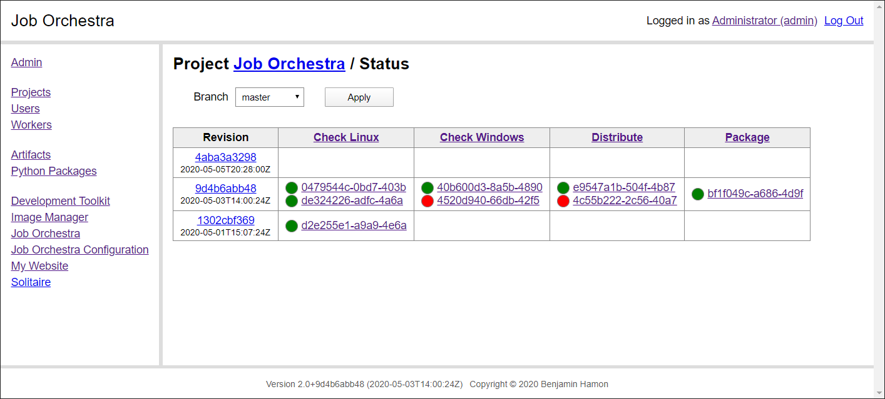

# Job Orchestra


## Overview

Job Orchestra is a toolkit for building a service which manages distributed job execution across a computer network. It is particularly suited as a base for making a continuous integration and delivery system that suits your team needs.

The project is open source software. See [About](about.md) for more information.




## Development

The project include commands to automate development related tasks. They are exposed by the `development/main.py` script. Check the script help, using the `--help` option, for information about commands. You can also run commands with the `--simulate` option to check their behavior before actually running them.

To set up a workspace for development, create a `python3` virtual environment, then run the `develop` command. This will install the project dependencies and packages in your python environment.

```
python ./development/main.py develop
```

Check out the [Documentation](documentation/home.md) for more information, notably the [Setup](documentation/setup.md) page for how to setup a local instance.
